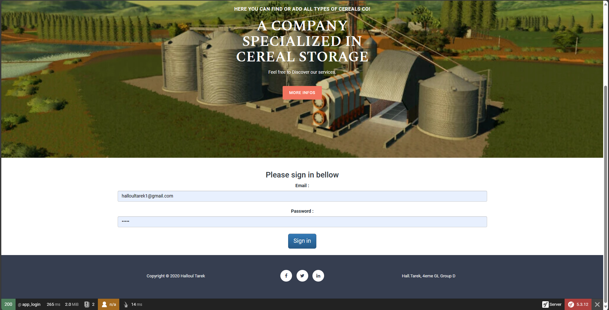

# CerealCompany

A second year symfony 5 project of my software engineering curriculum study.
This project is just a simple showcase of an MVC CRUD Web application in symfony 5.

## Showcase

This is the web app front vue:

to be able to access the app fonctionalities, the user needs to login:

This is the Cereal table:

The Cereal recorded table:

The Silo table to access the details about the cereals silos:

How to a add a silo:

the silo's showcase:

And the amount collected every year in detailed record table:

